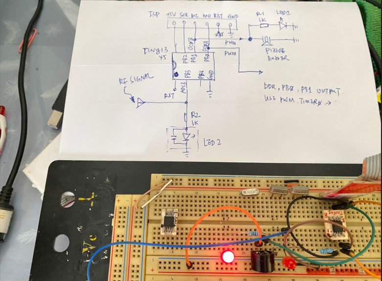

# avr_Tiny13_PWM_testing
Tiny13/45, OC0B/PB1 blink LED, use Timer0 ([MicroCore](https://github.com/MCUdude/MicroCore/tree/master/avr/libraries/AVR_examples/examples/Blink_using_Timer0) example code used as template)

LED1 blink 1Hz  
LED2, no uses

Tiny13 / 45 hex code for testing, ready to burn, usbtiny is used as programmer.  

uses Arduino IDE t ocompile and burn code.  

circuit diagram,  
 
